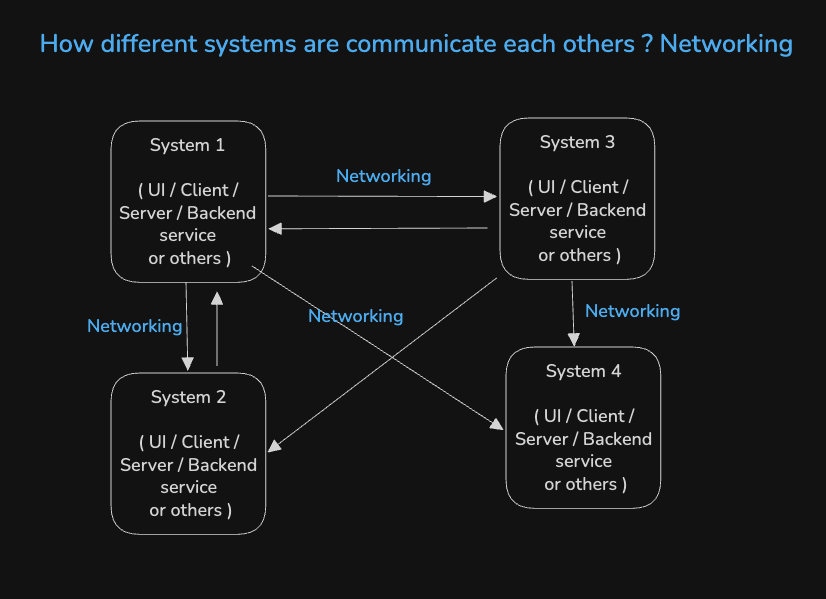

# 1 - Networking Akshay & Chirag's Experience

> Akshay and Chirag are sharing their experience on Networking.

## 1. Different aspects of networking, related to frontend

## 2. How frontend systems communicate to backend systems

## 3. How different systems communicate with each others

- Why do we need networking ?

  - To connect one system to another system
  - Example: When client web apps request to API to get data, what ever things happen between UI & Backend is networking

  

**Stopped at 15min**
